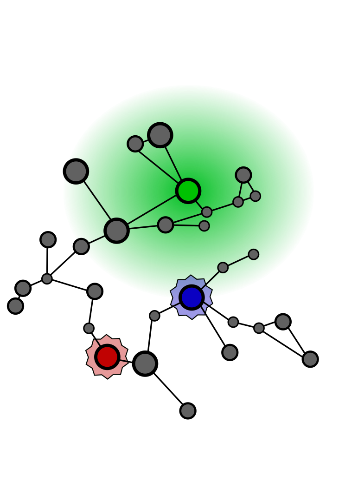

# Algorithm description

The meta-algorithm defined is used to build clusters in Aggregate Computing (or in general distributed systems).
It is a *meta*-algorithm since it defines the macro steps that we intend to use in a specific clustering process.
The process is divided into two macro-part: *cluster formation* and *cluster cleaning*

## Cluster formation
### Informal description
This phase defines *how* the cluster will be formed.
In our definition, we imagine that each cluster has a representative (leader) that maintains and expand a cluster. 
A node became a leader if a`candidate` condition is met. This will produce a key (`keyFactory`) that characterized the current cluster.
When a node became a candidate, it starts a `process` that expands some initial data (`input`) in the space until an `inCondition` is met.
All nodes inside that cluster, share with the leader some local information (`localData`) that will be collected (following a `collect` function) and used by the leader to describe the cluster shape.
The overall collected information could be finalized (`finalize`) by a leader to express the cluster found (`ClusterData`). Finally, this data will be shared with the cluster formed.

This phase produces clusters (Map from Key to ClusterData) that could be overlapped (thanks to the *process* abstraction).

| Concept | Description | Examples | Function shape |
|---|---|---|---|
| Input | The data used to decide if nodes are inside or outside a cluster | Temperature, cluster range | `() => Input` or `Cluster => Input` if we use feedback |
| Expand | Define how the input data changes during the gradient cast expansion | Identity (share the same data to other node) | `Field[Input] => Field[Input]` |
| Candidate | Define if a node could start the cluster process | Local temperature minimum, Random probability to became candidate | `() => Boolean` |
| KeyFactory | Produce a key from a current candidate node | `mid()` | `() => Key` |
|  In condition |  Define if a node is in or out a cluster | Temperature in certain range, node inside the cluster range | `Key => Input => Boolean` |
|  Local Data | Define data that will be collect from node inside the cluster | Current Position in space | `() => LocalData` |
|  Collect | Define how local data will be collect towards the leader point | Union of local data, Minimum, Maximum | `(LocalData, LocalData) => LocalData` |
|  Finalize | From the local data collected, the leader produced an information  that describes the current cluster | Centroid evaluation, identity | `LocalData => ClusterData` |

### ScaFi-Like pseudo code
```
// process starts when
val newProcesses = mux(candidate) { Set(keyFactory) } { Set.empty }
val clusters = spawn(logic, newProcess, input)

// logic body: process with the shape of Key => Input => ClusterData
val potential = gradient(leader, metric)
val expand = G(potential, input, expand(input), metric)
val collectedData = C(potential, (left, right) => collect(left, right), localData, null)
val cluster = broadcast(potential, finalize(collectedData))
return cluster // process result
```
## Cluster cleaning

The process above could lead to malformed clusters (i.e. multi overlapped clusters that are mapped to only *one* cluster). For this reason, two downstream phases are focused to clean clusters produced. These operations are performed by the leader (to make a consistent collective decision):

- *watch dog* (cluster suppression): A leader could choose to stop the clustering process when some local (or global) condition is fulfilled (i.e. delete the cluster that he is responsible for). An example of cluster suppression could happen when a certain node is not a candidate anymore.
- *union* (cluster union): A leader could perceive that the cluster founded by concurrent processes, in reality, express the same cluster. So he could decide to change its virtual cluster identity to another one.

The watchdog phase returns the key set of clusters that need to be stopped.

The leader then suppresses the cluster for which he is responsible.

In the union phases, the leader collects the output (the clusters) of all nodes in the same cluster for which he is responsible.
With this information, he verifies if two (or more) clusters are similar. In that case, he checks if he has to give up his identity to another cluster using a policy passed.

| Concept | Description | Examples | Function shape |
|---|---|---|---|
| Merge Policy | Define what clusters need to be suppressed | Kill a cluster when it is not a candidate anymore | `() => Set[Key]` |
| Union Policy | Define if a leader has to give his identity to another cluster | When two clusters have the same centroid, the cluster with the minimum ID is the union cluster | `Key, Clusters` => `(Key, ClusterData)`

### ScaFi-Like pseudo code
```
// new process for each leader
val potential = gradient(leader, metric)
// clusters is the clusters founded in the previous phase
val clustersFound = C(potential, _ ++ _, clusters, emptyClusters)
broadcast(leader, union(leaderKey, clusterFound))
```

## Graphical description
|  |  |  |  |  |
|---|---|---|---|---|
|  **Candidate Selection** | **Expansion** | **Collection and Finalization** | **Cluster Suppression** |  **Cluster Union** |
