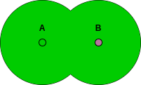
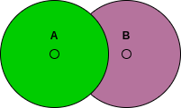

# A possible problem about poitwise merging strategy

A possible problem about pointwise merging strategy
Giorgio identifies a possible problem about the pointwise merging strategy that I have integrated into our meta clustering algorithm.

## Brief algorithm description
The general algorithm consists mainly of these four phases:
- Candidate selection: a "boolean" field that defines if a node could start the clustering process. It will be the cluster leader
- Cluster formation: the leader share some information (e.g. temperature value) using processes API. Nodes then use this information to choose if they are inside or outside that cluster  (i.e. external or internal to the process). This phase produces an associated cluster id and a piece of information about the created cluster (e.g. centroids, average temperature)
- Cluster suppression: The leader could suppress the cluster for which they are responsible (e.g. he is not the candidate anymore)
- Cluster merging: Using the output of Cluster formation, nodes (pointwise) choose if two clusters are similar (e.g. they have the same centroid), and then the nodes merge them accordingly.

## Partial overlap cluster

Suppose that there are two overlap clusters A and B. The leaders of the two clusters do not speak with each other.  
I would have a merge policy that produces only one cluster consisting of the union of A and B:

However, if we apply the policy pointwise, we can only produce two clusters like this:

## Possible solutions
- *Only the leaders perform the merge strategy and share the information within the process*: To do that, a possible way could be by starting other processes (one for each cluster key). The in/out condition depends on the process key (i.e. the cluster id) and the local cluster set. Then, using C, the leader collect all the clusters found. With that information, the leader performs the merge policy, and then he shares the merged cluster set using G.

## Considerations
The pointwise policy works well if we are interested to merge two clusters that are the same.

Indeed, in this case, making a central decision and then sharing it or sharing the information and then making a decision does not make any difference (as the processes are perfectly overlapped). 
